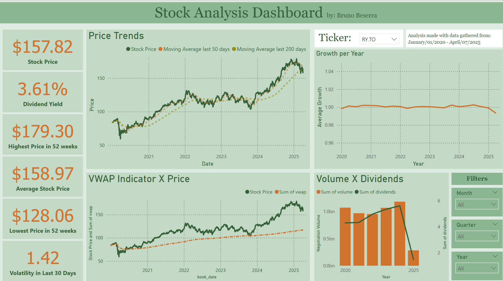

# 📈 Stock Analysis Project
Project developed to showcase my skills in an internship interview process. It displays a data pipeline illustrating the complete ETL process, and the dashboard created to show the information gathered

## 🔧 Overview

This pipeline uses the **Yahoo Finance API** in Python to fetch historical data for a given stock ticker or a set of given stock tickers. After extracting the raw data from the API, the project performs data transformation to calculate key financial metrics using the Python library PySpark. Then, the final dataset is exported as a CSV file and visualized using **Power BI**.

The historical data was gathered from 01-01-2020 to 04-04-2025.
To organize the workflow efficiently, the data is split into three layers inside a **data lake** and stored in **Parquet** format for optimized storage and querying.

## 🧱 Project Architecture

- **Extract:** Historical stock data is collected via the Yahoo Finance API.
- **Transform:** Calculates useful metrics such as:
  - Daily returns
  - Moving averages (50-day, 200-day)
  - Volatility
  - 52-week highs/lows
  - VWAP (Volume Weighted Average Price)
  - Dividend yield, and more.
- **Load:** 
  - Stores data in a structured data lake (bronze, silver, and gold layers).
  - Saves final outputs in both Parquet and CSV formats.

## 📊 Power BI Dashboard

The final data is used to create interactive dashboards for visual analysis. This helps track stock performance over time and supports data-driven investment decisions.
Note: This project is for educational purposes and should not be used for actual financial decision-making without proper validation.

## 🛠️ Tech Stack

- **Language:** Python
- **Data Source:** Yahoo Finance API (`yfinance`)
- **Big Data Processing:** Apache Spark (`pyspark`)
- **Data Manipulation:** PySpark SQL Functions, Window Functions
- **Date Handling:** datetime
- **Cloud Integration:** Google Colab + Google Drive
- **Storage Format:** Parquet, CSV
- **Visualization:** Power BI

## 📬 Contact

For any questions or collaborations, feel free to reach out!
